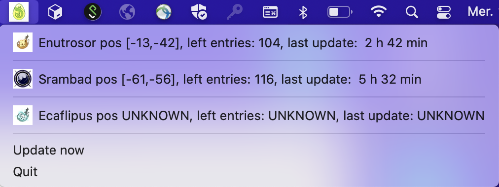

# DofusPortalWatch

DofusPortalWatch is a small application that allows you to know the position of the dimension portals, the number of 
remaining entries and the update date for the Agride server directly from the statusbar




## How to build the app

If you use pyenv, please run the following command
```
env PYTHON_CONFIGURE_OPTS="--enable-framework" pyenv install 3.9.2
pyenv local 3.9.2
```

Then, install
```
pip install virtualenv poetry
virtualenv .venv
poetry install
python setup.py py2app -A
dist/main.app/Contents/MacOS/main
```


## Useful link:
https://pythonlang.dev/repo/jaredks-rumps/